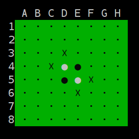

## Othello - with an AI! 

An Othello/Reversi game with an AI that searches the game tree via a mini-max search with alpha/beta pruning.

### Requirements

A terminal with 
- Unicode support
- ANSI escape code support

In a supported terminal the game will appear as below:



### How to build and run

```
$ git clone https://github.com/ccurro/othelloAI.git
$ cd othelloAI
$ make
$ ./othello
```

### Details on the AI

#### Opening moves database 

For its first 9 moves (the first 18 plies) the AI lookups moves in a openings
database. (Source: http://www.othello.nl/content/anim/openings.txt) If it
cannot find a valid move in the database it resorts to its search algorithm.

#### Search algorithm 

The search algorithm is a straight forward mini-max search with alpha/beta
pruning and iterative deepening - the only extra twist the implementation of
the so called "killer-heuristic". After each depth-limited search the optimal
path down the tree for that search is saved and is used as the search path for
the next depth limited search. This process can cause early alpha/beta cutoffs
(hence the "killer" in the name) allowing greater depths to reached a time
limited iterative deepening search.

Near the end of the game, when it has enough time, the AI will search the
remainder of the game tree down to the terminal states rather than use its
heuristic function which estimates its chances at winning.

The primary factor in determining how many nodes the search can visit within a
time limit is the speed of the function that computes the valid moves. As such
I spent a considerable amount of time designing the algorithm to have minimum
complexity. The algorithm starts by visiting the discs of the current player,
then visits all discs in the outwards directions keeping track potential
candidate discs to be flipped in a doubly linked list (chosen for constant
time concatenation), as it continues in the outwards direction, if it finds a
valid move location, it inserts this location and the discs to be flipped into
a hash table (chosen for constant time insertion and lookup). From here it
moves to another of the player's discs, and continues outward from there -
if it revisits the potential move location with additional discs to be flipped it
looks up the candidate discs to flipped in the hash table and concatenates
it's candidates onto the list.

Aside from carefully designing the algorithm I also took care to optimize the
implementation by studying it with Valgrind. In Valgrind I noticed I could
cut down on implicit calls to `new` and `del` and vastly increase the amount
of memory reuse to speed up the implementation.

#### Heuristic function

The heuristic function keeps track of several different statistics to evaluate
how strong a position is for given player. It's implemented as a linear
combination of these statistics:

- Mobility (ratio of the number of the players moves to the number of the opponents moves)
- Potential mobility (ratio of number of opponents frontier discs to the number of the players frontier discs)
- "Makeup" (the ratio of player discs to opponent discs (only included at a low weight))
- Pivotal squares, C-squares, and X-squares (measures players control of these important squares, however when a corner becomes occupied the nearest pivotal square, c-squares, and x-squares are no longer included in this metric)
- Corner squares (measures control of corners; weighted highly)
- Stability (measures ratio of the number of the player's stable discs compared to opponents; offers only a lower bound on the number of stable discs, it does not actually compute the exact number for performance reasons; weighted highly)
- Parity (measures which player is expected to have the final move; weighted highly)